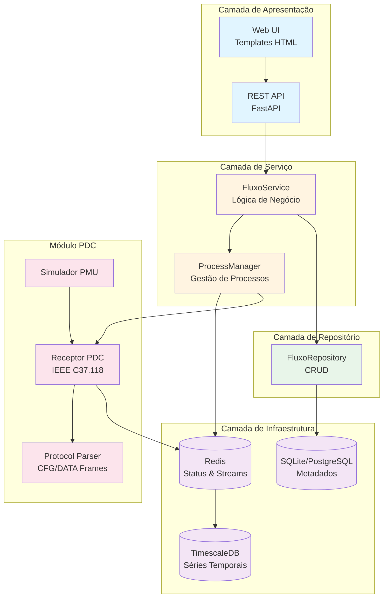
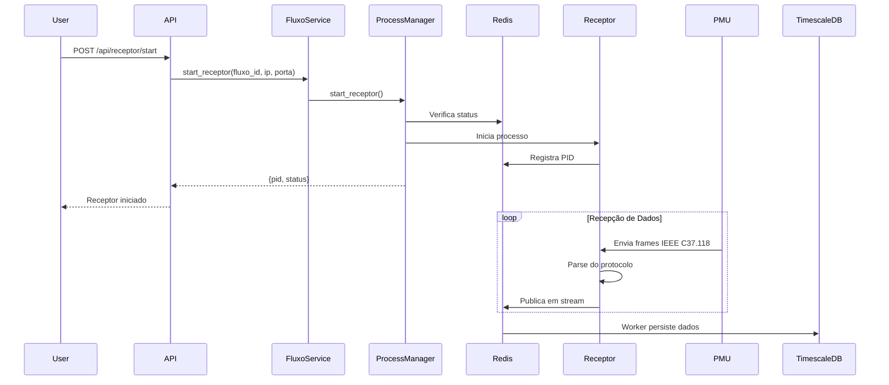
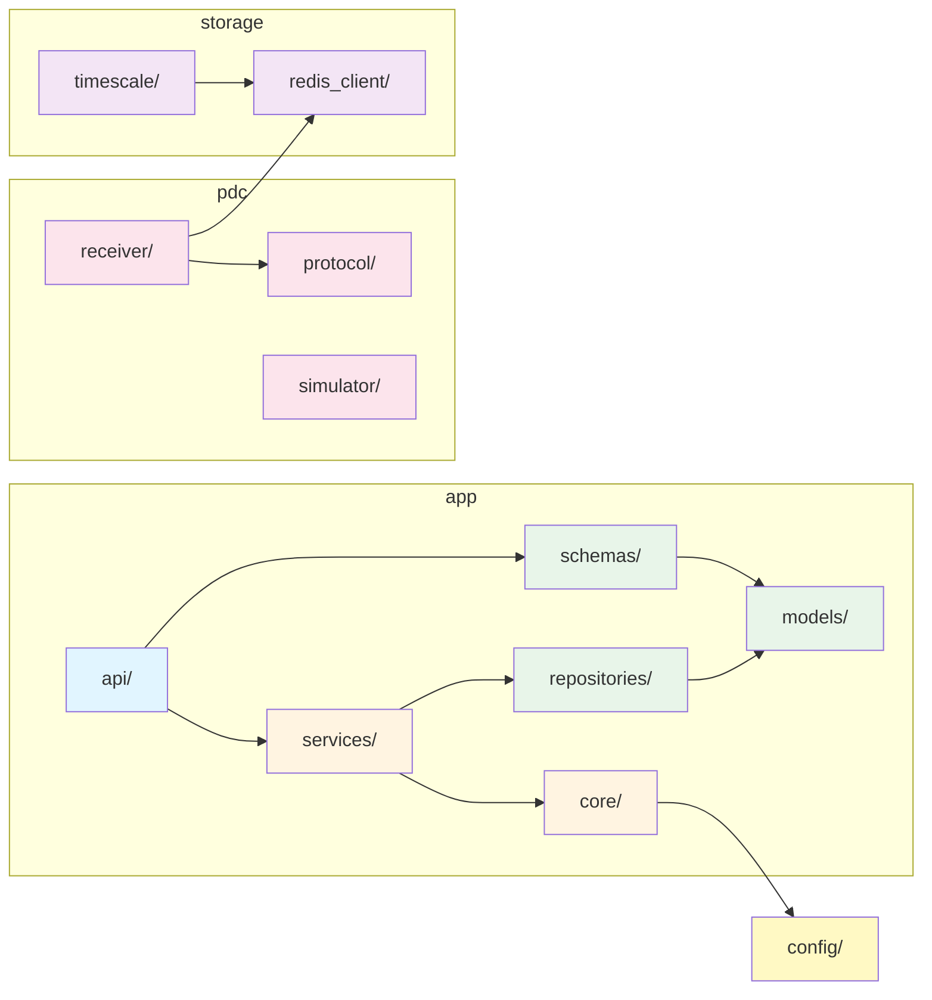

# Arquitetura do Smart-Gemini PDC

## Visão Geral

O Smart-Gemini PDC segue uma **arquitetura em camadas** (Layered Architecture) com separação clara de responsabilidades.

## Diagrama de Arquitetura



## Fluxo de Dados



## Estrutura de Módulos



## Camadas e Responsabilidades

### 1. Camada de Apresentação (API)
**Localização**: `app/api/`

**Responsabilidades**:
- Receber requisições HTTP
- Validar entrada (via Pydantic)
- Serializar respostas
- Renderizar templates HTML

**Componentes**:
- `web_routes.py`: Páginas HTML
- `fluxo_routes.py`: API REST para fluxos
- `receptor_routes.py`: Controle de receptores

**Princípios**:
- Não contém lógica de negócio
- Delega operações para a camada de serviço
- Trata apenas aspectos HTTP

### 2. Camada de Serviço (Business Logic)
**Localização**: `app/services/`

**Responsabilidades**:
- Implementar regras de negócio
- Orquestrar operações entre repositórios
- Validar regras de domínio
- Gerenciar transações complexas

**Componentes**:
- `fluxo_service.py`: Operações de negócio para fluxos
- `process_manager.py`: Gerenciamento de processos receptores

**Princípios**:
- Independente de HTTP (pode ser usado em CLI, workers, etc.)
- Orquestra múltiplos repositórios se necessário
- Contém a lógica central da aplicação

### 3. Camada de Repositório (Data Access)
**Localização**: `app/repositories/`

**Responsabilidades**:
- Acesso direto ao banco de dados
- Operações CRUD
- Queries complexas
- Abstração do ORM

**Componentes**:
- `fluxo_repository.py`: CRUD de fluxos

**Princípios**:
- Não contém lógica de negócio
- Apenas operações de banco de dados
- Retorna modelos de domínio

### 4. Camada de Modelo (Domain)
**Localização**: `app/models/` e `app/schemas/`

**Responsabilidades**:
- Definir estruturas de dados
- Validação de tipos
- Mapeamento objeto-relacional

**Componentes**:
- `models/fluxo.py`: Modelo SQLAlchemy
- `schemas/fluxo.py`: Schemas Pydantic

**Princípios**:
- Representam o domínio do negócio
- Independentes de frameworks
- Reutilizáveis em toda a aplicação

### 5. Camada de Infraestrutura (Core)
**Localização**: `app/core/` e `config/`

**Responsabilidades**:
- Configuração da aplicação
- Conexões com serviços externos
- Logging
- Utilitários

**Componentes**:
- `core/database.py`: Configuração SQLAlchemy
- `core/logging_config.py`: Configuração de logging
- `config/settings.py`: Configurações centralizadas

**Princípios**:
- Fornece infraestrutura para outras camadas
- Configurável via variáveis de ambiente
- Reutilizável

## Módulo PDC (IEEE C37.118)

**Localização**: `pdc/`

**Responsabilidades**:
- Implementar protocolo IEEE C37.118
- Receber dados de PMUs
- Simular PMUs para testes

**Componentes**:
- `protocol/`: Parsing de frames CFG, DATA, CMD
- `receiver/`: Receptor assíncrono de dados
- `simulator/`: Simulador de PMU

**Princípios**:
- Independente da aplicação web
- Reutilizável em outros projetos
- Segue padrão IEEE C37.118.2-2011

## Armazenamento de Dados

### Redis
**Uso**:
- Status de processos receptores (hashes)
- Streams de dados em tempo real
- Cache de configurações

**Estrutura de Chaves**:
```
receptor:{fluxo_id}          # Hash com PID, status, IP, porta
stream:fluxo:{id}:pmu:{id}:data  # Stream de dados
```

### SQLite/PostgreSQL
**Uso**:
- Metadados de fluxos
- Configurações persistentes
- Dados de cadastro

**Tabelas**:
- `fluxos`: Configuração de fluxos PDC

### TimescaleDB
**Uso**:
- Séries temporais de medições
- Dados históricos de PMUs
- Análise de qualidade de energia

**Tabelas**:
- `pmu_data`: Medições de PMUs com timestamp

## Padrões de Design Utilizados

### 1. Repository Pattern
Abstrai acesso a dados, permitindo trocar implementação sem afetar lógica de negócio.

### 2. Service Layer Pattern
Separa lógica de negócio da camada de apresentação.

### 3. Dependency Injection
FastAPI fornece dependências (DB session) via `Depends()`.

### 4. Factory Pattern
`setup_logging()` cria loggers configurados.

### 5. Singleton Pattern
`settings` é instância única de configurações.

## Escalabilidade

### Horizontal
- **API**: Múltiplas instâncias FastAPI atrás de load balancer
- **Receptores**: Processos independentes por fluxo
- **Workers**: Múltiplos workers consumindo do Redis

### Vertical
- **Banco de dados**: Migração de SQLite para PostgreSQL
- **Cache**: Redis com persistência e replicação
- **Séries temporais**: TimescaleDB com compressão e particionamento

## Segurança

### Autenticação (Futuro)
- OAuth2 / JWT para API
- Session-based para web UI

### Autorização (Futuro)
- RBAC (Role-Based Access Control)
- Permissões por fluxo

### Validação
- Pydantic valida todos os inputs
- SQLAlchemy previne SQL injection

## Monitoramento

### Logging
- Logs estruturados em arquivo rotativo
- Níveis configuráveis (DEBUG, INFO, WARNING, ERROR)

### Métricas (Futuro)
- Prometheus para métricas
- Grafana para dashboards

### Health Checks
- Endpoint `/health` para verificação de status
- Verificação de conexões (Redis, DB)

## Testes

### Unitários
- Testar cada camada isoladamente
- Mocks para dependências externas

### Integração
- Testar fluxo completo de operações
- Banco de dados de teste

### End-to-End
- Testar via API HTTP
- Validar interface web

## Documentação

### Código
- Docstrings em todas as funções e classes
- Type hints para melhor IDE support

### API
- OpenAPI/Swagger automático (FastAPI)
- Exemplos de uso

### Arquitetura
- Este documento
- Diagramas Mermaid
- Guia de migração

